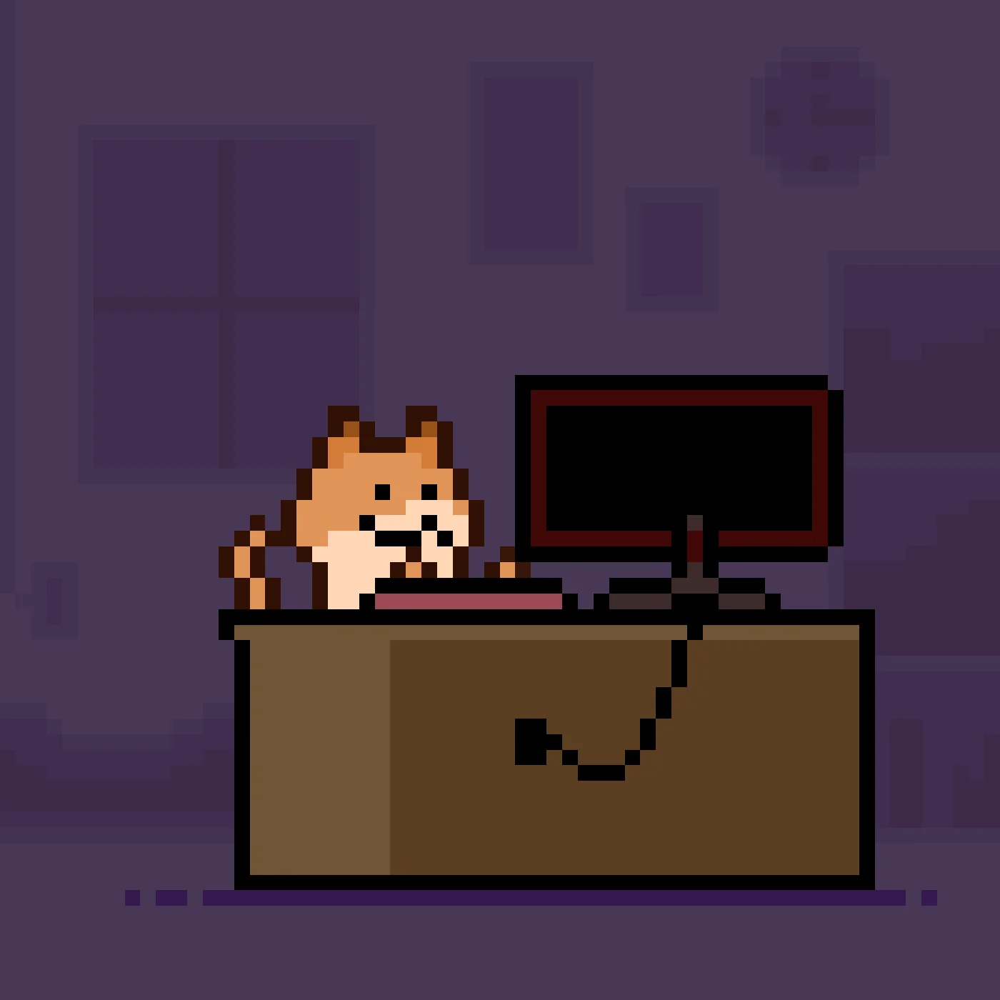
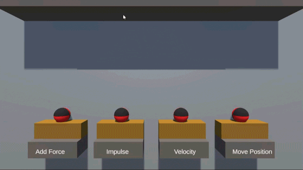

# COMP2160 Game Development – Prac Week 9

## Topics covered:
* Rigidbody Physics
* Update vs FixedUpdate
* Collisions

## Non-Discussion Question
There is no discussion question today. Happy coding!



## Today's Task
In this practical, you will be creating a technical prototype of a rising and falling platform to better understand how Unity's physics engine works. Technical prototypes are an important part of game development, and involve experimenting with different approaches to solve a problem. They are also a great way to uncover new techniques and approaches that you may use later.

You can check out an implementation of this technical prototype here: https://uncanny-machines.itch.io/comp2160-week-09-sample

### The project
The framework for today implements the general environment, including a "BumperPrefab" object which includes the following components:
* Floor: A cube with a texture and a Collider, but no Rigidbody. It is therefore static and does not move.
* Bumper: A cube with a texture and a Collider and a Rigidbody. Examine the Rigidbody component in the Inspector, with reference to the Rigidbody Scripting Reference: https://docs.unity3d.com/ScriptReference/Rigidbody.html. Make sure you know what is going on.
* Label: A world-space canvas with a Text object. We will edit this text so can see which physics implementation is which.

There is also a `PlayerActions` InputActionsAsset and related script.

## Step 1 – Adding Forces (20 min) 

### General set-up
We will use our first Bumper prefab to begin experimenting with movement. Our goal is to have the "Bumper" move upwards when the player presses the space bar, and then move back down on its own.

Up to now, we've moved everything using the transform component. While this is suitable for games that do not simulate physics, if we wanted to have our bumper react to other objects and external forces (like gravity), we need to start using the Physics engine. For this, we will be using the Rigidbody in non-kinematic mode, and normal Colliders over Triggers.

We have provided a `Bumper` script with the necessary Input set-up already done.

As our object is going to be dependent on physics, we need to make sure the Rigidbody component isn't accidentally destroyed or removed. Above the class header for `Bumper`, add the directive `[RequireComponent(typeof(Rigidbody))]`.

This line will ensure a Rigidbody is always added to the object. As you progress as a developer, adding these "rules" into your scripts is a good habit to get into. If your code expects a component to exist and be configured in a particular way, it is better to force this in code rather than rely on remembering to do it in the editor.

We also need to declare a new rigidbody variable and fetch it from our Bumper object:

```
private Rigidbody rigidbody;
```
...
```
Awake()
{
    rigidbody = GetComponent<Rigidbody>();
}
```

Once you have done all of this, attach the `Bumper` script to the `Bumper` object, which is a child of the 'BumperPrefab' object.

### FixedUpdate and AddForce
We are going to start by just adding a force to our bumper. As adding forces interacts with the physics engine, we want to do this in the `FixedUpdate()` rather than `Update()` method. We don't need to get into all the details here, but you can check out the lectures for more information on why we use `FixedUpdate()` over `Update()` for physics calculations, and not for things like transform movement or other game logic.

The `AddForce()` method applies a force to the rigidbody, which is inputted as a Vector3. Much like when we used `Translate()`, we can therefore pass in a direction (such as Vector3.up) and a force value. Go ahead and create the necessary variables, such as a float paramater for the force amount (note: this number needs to be quite high!). Remember to give these values meaningful names.

Then, add a call to the `FixedUpdate()` method, and call the `AddForce()` function on your rigidbody (replacing my example variable names with whatevery you set yours to):

```
void FixedUpdate()
{
    rigidbody.AddForce(Vector3.up * forceAmount * Time.fixedDeltaTime);
}
```

Note we are now using `Time.fixedDeltaTime` instead, as we are working in FixedUpdate.

If all goes well, when you hit play your bumper should fly up into the air and off the screen. This is because the force is being applied every single `FixedUpdate()`, so we never see it come back down.

Instead, we want to have this force only be applied when the player presses the "Bump" button.

## Step 2 – Adding Input (20 min)
The difficulty with working with input and physics is that because of when `FixedUpdate()` is called, we do not want to call input here. Instead, we still want to handle all input happening during `Update()`.

Following the event-driven input pattern, create a new method for reading when the Bump button is pressed. I'm calling mine "BumpPressed". We will use this method to set a boolean called `bump` to true:

```
void BumpPressed(InputAction.CallbackContext context)
{
    bump = true;
    Debug.Log("Bump!");
    }
```

Then, in our FixedUpdate, we will add an if statement to only apply force if bump is set to true, and then set bump to false once the force has been applied:

```
void FixedUpdate()
{
    if (bump)
    {
        rigidbody.AddForce(Vector3.up * forceAmount);
        bump = false;
    }
}
```
You will see we have removed `Time.fixedDeltaTime`, as we are just applying the force once, then waiting for the input again, rather than constantly each `Update()` or `FixedUpdate()` call.

Note: You can run into synchronisation issues between `Update()` and `FixedUpdate()` with input, especially when using polling. See the lecture slides for more info.

Now our bumper moves up and comes back down! However, something you may notice - especially if you spam the bump button - is that our bumper is starting to shift a bit in place and rotating. This isn't quite what we want in this case, so we want to constrain certain elements of the rigidbody. Open the "Constraints" section on the Rigidbody component, and tick all the Rotation boxes to prevent it from rotating.

And this is our first bumper! Change the label text to reflect that this bumper is controlled using "Add Force".


### Checkpoint! Save, commit and push your work now

## Step 3 – Experiment with Bumper physics (30 min)
We’re going to experiment with different ways of moving the bumper up and down using rigidbody physics. Rather than providing you with the solution for each, we will be giving you the links to documentation and asking you to implement solutions in each one. 

Don't worry if some of your results are a bit weird - this is about stepping outside of your comfort zone and experimenting. This is where you become a true game developer!

Create four versions of the Bumper script. Rename their file and class names to reflect what mode you are implementing (Note: you could also achieve this with one or two copies and necessary enumerators/flags. It's up to you!):

* <b>Impulse:</b> When the player presses space\, add an impulse to move the bumper upwards using rigidbody.AddForce() with [ForceMode.Impulse](https://docs.unity3d.com/ScriptReference/ForceMode.Impulse.html). 

* <b>MovePosition:</b> Move the bumper upwards using [rigidbody.MovePosition()](https://docs.unity3d.com/ScriptReference/Rigidbody.MovePosition.html). Note that for this approach, the bumper will continue to move upwards as this is a movement, not a force - you'll need to turn off the "bump" bool (such as through a method for the button being released, or by setting a max height).

* <b>Velocity:</b> Move the bumper upwards at a fixed velocity using [rigidbody.velocity](https://docs.unity3d.com/ScriptReference/Rigidbody-velocity.html). Note that for this approach, the bumper will continue to move upwards as this is a consistantly applied velocity - you'll need to turn off the "bump" bool (such as through a method for the button being released, or by setting a max height).

Create and line-up each of these implementations next to each other, changing the labels as you go. Run your game and observe the difference between them. Tweak some of the values.

### Adding balls & A Ceiling
Create spheres with rigidbodies and colliders on them, and place them above each bumper. Observe how they interact with their bumpers. Add a static ceiling by creating a new cube with a collider but no rigidbody and place it above your objects.


Your scene should look something like this:



For each version, make a few notes on the behaviour of each. Consider what each one is most appropriate for. Some scenarios to get you going:

* Which one would be best for a moving platform in a platformer game?
* Which one would be best for an elevator in an RPG or action game?
* Which one would be best for a pinball game?

Explore how the other parameters on the bumper and ball rigidbody components ( drag, collision detection mode, etc) affect each version. Try and find your optimal bumper movement. You can also try adding some [Physic Materials](https://docs.unity3d.com/560/Documentation/Manual/class-PhysicMaterial.html) to see how this influences things.


Note: At this stage, you may have some bugs. Don't worry, this is what a technical prototype is all about. You will be fixing these bugs for the full-mark.

## Checkpoint! Save, commit and push your work now

### To receive half marks for today, show your demonstrator:

* Your four approaches to moving the Bumper up and down using physics
* Your findings from experimenting with each, and what each one is good for.
* Any changes you made to the rigidbody components or script to get it moving right.

### Step 4 - Better Reactions
At the moment, there are a few problems. Things are getting there, but feeling a bit stiff. Pick one of the examples from above (moving platform, elevator, pinball bumper) and see if you can get one of your four bumpers simulating that experience nicely.

Consider if you need to add an other forces to your bumpers (hint: you can have more than one force impacting an object at once, such as a downwards "extra gravity" force). Also consider what other flags, such as an OnGround check, you might want to do when the bumpers collide with their floors. 

By making a few changes to your code involving collisions and other forces, you should be able to create some good bumper and ball reactions. Ask your demonstartor if you get stuck!

## Prac complete! Save, commit and push your work now

### To receive full marks for today, show your demonstrator:
* How you got your bumpers and balls reacting properly.
